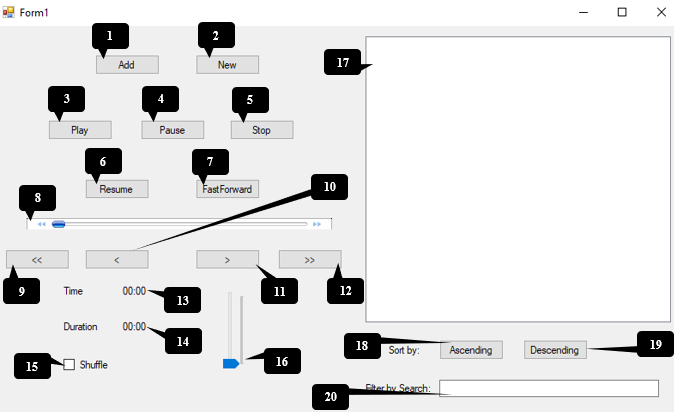

# Music-Player

  

 The Initial Box is the interface when you run the code which contains couple of function which are labeled through number. The following label are below:
1.	Add		 				
2.	New
3.	Play
4.	Pause
5.	Stop
6.	Resume
7.	Fast Forward
8.	Progress Bar
9.	First Song
10.	Previous Song
11.	Next Song
12.	Last Song
13.	Time of Music
14.	Duration of Music
15.	Shuffle
16.	Volume Bar
17.	List Box
18.	Sort by Ascending
19.	Sort by Descending 
20.	Search Music

# Code Description
In the WORD document as "Code.docx"

# Installation
Install Visual Studio to PC and then just click the "MusicPlayer.sln" file, which should open the whole project. There are sample audio's in the folder which is in two sets
one with the number and the other with the letters, to be able to sort them out in the music player.

# Description

A playlist is a list of video or audio files that can be played back on a media player either sequentially or in a shuffled order. In its most general form, an audio playlist is simply a list of songs, but sometimes a loop.

Some Internet streaming services, such as Spotify, Amazon Music, Project Playlist, MagicPlaylist, 8tracks, Plurn and Webjay, allow users to categorize, edit, and listen to playlists online. Other sites focus on playlist creation
aided by personalized song recommendations, ratings, and reviews. On certain sites, users create and share annotated playlists, giving visitors the option to read contextual information or reviewer comments about each song while listening.

My project is to create a music player that has the means to function like a player should. It could be done using any Programming language, on addition must have three things (Search Algorithm, Sort Algorithm and an Abstract Data Type).
The following are the choices I made:

*	For Language: C# Language.
*	For ADT: Queue with Array Implementation.
*	For Search Algorithm: Linear Search.
*	For Sort Algorithm: Bubble Sort.
